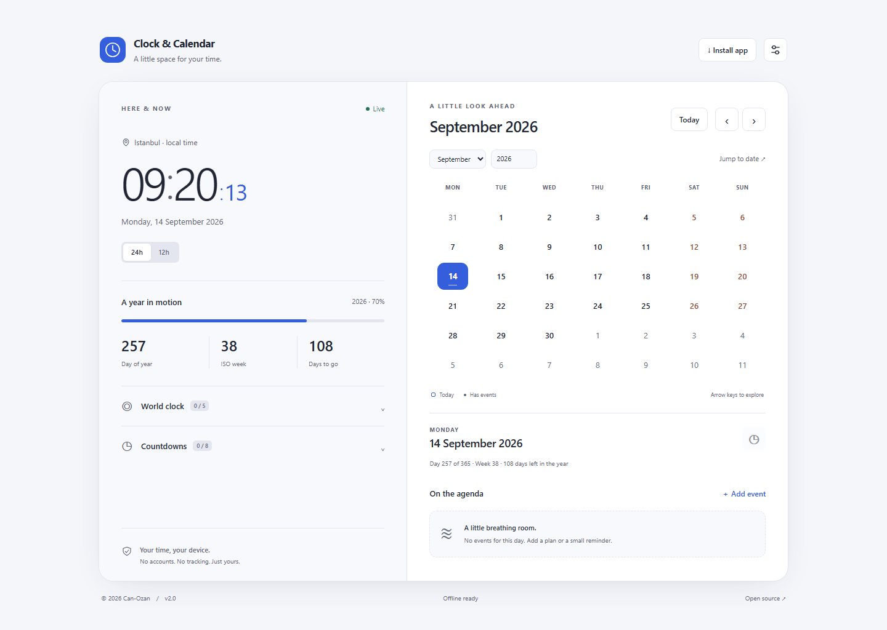

# Clock & Calendar Widget

A modern, privacy-friendly clock and calendar application built with Vanilla TypeScript and Vite.

Version 2.0 adds personal time-management utilities while staying lightweight, with no runtime dependencies and all personal data kept in the browser.

[](https://github.com/Can-Ozan/Clock-Calender-Widget/actions/workflows/ci.yml)
[](LICENSE)

## Preview



[Dark theme](docs/preview-dark.png) · [Mobile layout](docs/preview-mobile.png)

Screenshots show the locally running production build.

## Overview

Keep the current time, a monthly calendar and selected-date information together with local events, countdowns and world clocks. Timezone controls, personal appearance settings and offline support make it useful as an everyday browser workspace.

## Features

### Clock

- Real-time display with 12-hour/24-hour formats, optional seconds and blinking separators.
- Automatic local timezone detection or an IANA timezone selection, with saved preferences.
- One aligned clock timer pauses in hidden documents and ticks by the minute when seconds are hidden.

### Calendar

- Monday-first, six-week monthly grid with previous/next month, Today, month/year controls and date jump.
- Selecting an adjacent-month date opens that month; keyboard navigation separates focus from selection.
- Selected-date details include weekday, day of year, ISO week and week-year, and days remaining in the year.

### Events

- Create, edit, move to another date and delete events, with up to **1,000** saved entries.
- Fields: title, date, optional time, optional note, and Personal, Work or Important category.
- Calendar dots and accessible event counts identify dates with plans. Event times are labels; there are no alarms or notifications.

### Countdowns

- Create, edit and delete up to **eight** titled date targets, including from a selected future date.
- Show calendar days remaining, a target-day message or elapsed days. Existing targets remain editable after their date.

### World clock

- Add and remove up to **five** timezones in an expandable list with saved preferences.
- Each location shows its local time and date; timezone conversion follows the browser's daylight-saving rules.

### Personalization

- Light, Dark and System themes; System follows operating-system theme changes.
- Blue, Purple, Emerald and Orange accents, plus English and Turkish interfaces.
- Responsive desktop/mobile layouts, saved clock preferences and expandable personal tools.

### PWA and offline use

- A Web App Manifest, local icons and a service worker support installation in compatible browsers.
- Once the application assets are cached, the clock, calendar and personal tools work through offline reloads.
- Available updates wait for **Update now**, letting you finish open edits first.

The main clock and its statistics follow the selected timezone. Calendar dates, events and countdowns use device-local civil dates. Countdown values count calendar days; days remaining in a year exclude the selected day.

## Privacy

No account, backend or server database is required. The application stores events, countdowns and preferences in your browser and does not send personal calendar information to a server. It uses local assets and system fonts, without analytics or external application APIs.

**Clearing site storage removes saved data.** Local data is not encrypted or backed up, and it does not synchronize between devices or browser profiles.

## Tech stack

| Area                  | Tools                                                        |
| --------------------- | ------------------------------------------------------------ |
| Application           | Vanilla TypeScript, HTML5, modern CSS                        |
| Development and build | Vite                                                         |
| Testing               | Vitest, Playwright, axe-core                                 |
| Quality               | Strict TypeScript checking, ESLint, Prettier, GitHub Actions |

Native browser APIs include `Intl` for dates/timezones, `localStorage` for persistence, `matchMedia` for appearance, and Service Worker/Cache Storage with a Web App Manifest for offline use. Dependency ranges are maintained in [package.json](package.json) and resolved in [package-lock.json](package-lock.json).

## Project structure

```text
src/
├── components/       Settings, selected-date, event, countdown and world-clock UI
├── services/         Validated stores and storage recovery
├── types/            Shared domain interfaces
├── utils/            DOM, dialog, language and timezone helpers
├── Calendar.ts       Calendar rendering, selection and keyboard focus
├── Clock.ts          Clock display and scheduling
├── DateUtils.ts      Civil dates, ISO weeks and formatting
├── main.ts           Application coordination and lifecycle
└── pwa.ts            Installation, offline status and update controls
tests/                Unit tests
e2e/                  Browser, accessibility and PWA tests
public/               Manifest, app icons and robots.txt
scripts/              Worker generation, timezone tests and asset helpers
docs/                 Audit, validation evidence and screenshots
index.html            Application markup and native dialogs
style.css             Themes, focus states and responsive layouts
```

## Getting started

Use **Node.js 24** (recommended in [.nvmrc](.nvmrc)) and npm. The supported Node range in `package.json` is `^22.13.0 || >=24.0.0`: Node 22.13+ within 22.x, or Node 24+.

### Clone and install

```sh
git clone https://github.com/Can-Ozan/Clock-Calender-Widget.git
cd Clock-Calender-Widget
npm install
```

Use `npm ci` instead of `npm install` for reproducible installs from the lockfile, especially in CI.

### Development

```sh
npm run dev
```

Open [localhost:3000](http://localhost:3000). The development server requires that port to be available.

### Production build and preview

```sh
npm run build
npm run preview
```

The build typechecks the project, writes the application to `dist/` and generates its service worker. Preview normally serves it at [localhost:4173](http://localhost:4173); use the URL printed by Vite if that port is occupied. Serve the app over HTTP(S), rather than opening an HTML file directly.

## Available scripts

| Command                 | Description                                              |
| ----------------------- | -------------------------------------------------------- |
| `npm run dev`           | Start the development server                             |
| `npm run build`         | Typecheck, build the app and generate the service worker |
| `npm run preview`       | Serve the production build locally                       |
| `npm run typecheck`     | Check application and test types without emitting files  |
| `npm run lint`          | Run ESLint with type-aware TypeScript rules              |
| `npm run format`        | Format maintained files with Prettier                    |
| `npm run format:check`  | Check formatting without writing changes                 |
| `npm run test`          | Run unit tests once                                      |
| `npm run test:watch`    | Run unit tests in watch mode                             |
| `npm run test:coverage` | Measure date-utility and store coverage                  |
| `npm run test:tz`       | Run date tests under UTC, New York, Berlin and Auckland  |
| `npm run test:e2e`      | Run Chromium browser, accessibility and PWA tests        |

## Keyboard accessibility

Tab into the calendar to focus one date. Native buttons and dialogs, visible focus states, status announcements and reduced-motion styles support keyboard use.

| Key, while a date is focused | Action                                                                             |
| ---------------------------- | ---------------------------------------------------------------------------------- |
| Arrow Left / Right           | Focus the previous / next day                                                      |
| Arrow Up / Down              | Focus the previous / next week                                                     |
| Page Up / Page Down          | Focus the corresponding date in the previous / next month, clamped to month length |
| Home                         | Focus today and show its month                                                     |
| Enter / Space                | Select the focused date and update its details/events                              |

Arrow keys move focus without selecting. The **Today** button selects today. Tab/Shift+Tab moves between controls, and Escape closes a dialog. Calendar shortcuts do not capture keys in form fields.

## Testing and quality

- **Unit tests:** Vitest covers civil dates, leap years, ISO week-years, timezone boundaries, clock formatting, storage validation, recovery and event/countdown operations.
- **Browser/E2E tests:** Playwright targets Chromium and exercises navigation, persistence, themes, responsive layouts, console errors, axe accessibility scans, installation metadata, offline reloads and accepted updates.
- **Local validation:** [Validation Report](docs/VALIDATION.md) records the previous build's executed checks, measurements and limits. OS-level installation and manual screen-reader testing were not performed.

Run the core checks:

```sh
npm run typecheck
npm run lint
npm run test
npm run build
```

For browser tests, build first, then install the test browser and run Playwright. Its configuration starts the development and preview servers, or reuses running servers locally.

```sh
npx playwright install chromium
npm run test:e2e
```

[CI](.github/workflows/ci.yml) is configured on Node 24 for pushes to `main` and pull requests. It runs typechecking, linting, formatting checks, unit coverage, the timezone matrix, a production build and Chromium browser tests.

### Lighthouse

The [saved Lighthouse measurements](docs/lighthouse.json), recorded on **14 September 2026**, show **100/100/100/100** for Performance, Accessibility, Best Practices and SEO in both mobile and desktop runs. These are local production-build measurements on Windows with Chromium, not hosted-production results or guarantees for other environments.

## Browser support

The app uses modern browser standards, including native dialogs and the APIs listed above. Automated browser testing currently covers **Chromium only**. Firefox, Safari, other browser/device combinations and OS-level installation have not been fully validated; installation availability depends on the browser and operating system.

## Data storage

| localStorage key            | Content                                                    |
| --------------------------- | ---------------------------------------------------------- |
| `clock-calendar:settings`   | Clock, theme, accent, language and world-clock preferences |
| `clock-calendar:events`     | Event records                                              |
| `clock-calendar:countdowns` | Titled date targets                                        |

Records are versioned and validated. The original `theme` preference is recognized when v2 settings are absent. Unreadable data produces a warning; unavailable or full storage keeps changes only in memory for the session.

Tabs on the same origin receive saved-data changes; simultaneous writes are last-write-wins. Different hostnames and ports have separate storage. Cache Storage holds offline application assets separately from personal records.

## PWA installation

1. Serve a **production build** from HTTPS or localhost; service workers are disabled in development.
2. Wait for **Offline ready** in the footer before testing an offline reload.
3. Choose **Install app**, or use a browser-provided installation option. If no install prompt is available, the button opens installation guidance.
4. Finish unsaved edits before accepting **Update now**. Updating reloads the page and preserves saved localStorage records.

Installation is optional and depends on support for a compatible secure origin and browser installation features.

## Live Demo

The latest version of **Clock & Calendar Widget v2.0** is available on GitHub Pages:

**https://can-ozan.github.io/Clock-Calender-Widget/**

## Deployment

The project is automatically deployed to **GitHub Pages** using GitHub Actions.

Every push to the `main` branch triggers the deployment workflow:

```text
.github/workflows/deploy-pages.yml
```

## Documentation

- [Audit Report](docs/AUDIT.md) — original findings and implementation plan.
- [Validation Report](docs/VALIDATION.md) — executed checks, measurements and known limits.

## Contributing

1. Fork the [repository](https://github.com/Can-Ozan/Clock-Calender-Widget) and create a branch.
2. Make focused changes with relevant tests.
3. Run `npm run typecheck`, `npm run lint`, `npm run test` and `npm run build`; check formatting and run browser tests for UI/PWA changes.
4. Open a pull request describing the change and its validation.

Keep generated artifacts and local data out of source control.

## License

[MIT](LICENSE). Copyright attribution is preserved in the license file.

## Author

Created by [Can-Ozan](https://github.com/Can-Ozan).
